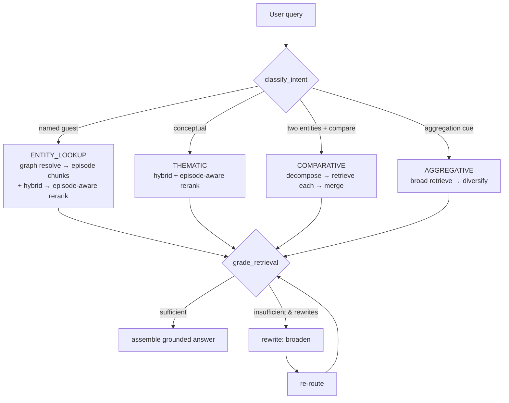

# MusicRAG — RAG 2.0 Upgrade Spec

**Agentic retrieval, an episode-aware reranker, and a measurement-first path beyond the hybrid+rerank baseline.**

| | |
|---|---|
| **Project** | `musicrag` |
| **Owner** | GRATITUD3 |
| **Author** | Senior Cognitive Architect / RAG Engineer |
| **Status** | Tier-0 + agentic prototype implemented; semantic-search items are roadmap |
| **Date** | 2026-06-28 |
| **Doc type** | Agent-executable upgrade spec (read top-to-bottom; each Phase has a Definition of Done) |
| **Companion** | Builds on `MusicRAG-GOAL.md` (P0–P8). This is the "P9+" layer. |

---

## 0. Why this document

The base system (GOAL.md, P0–P8) is strong: timestamp-aware chunking, `voyage-context-4` contextual embeddings, hybrid vector+full-text with RRF, a denormalized context graph, deep-link citations, and a real golden-set eval. Two issues cap its ceiling, and both are visible in the repo itself:

1. **The reranker is regressing ranking quality.** `eval/report.md` shows reranking *lowers* MRR@10 (0.868 → 0.730) and nDCG@10 (0.871 → 0.775) while only nudging Recall@10 up (0.882 → 0.912). For a known-item Q&A product, the single best answer dropping down the list is the wrong trade.
2. **The context graph is built but barely used at query time.** Every query runs one identical pipeline (`embed → vector+text → RRF → rerank`). There is no routing, no reflection, and no graph reasoning — so named-entity / known-item questions that the graph could answer instantly instead fail (three golden questions score **0.0 on both baseline and reranked**).

This spec fixes #1, closes #2 with an agentic layer, and makes both **provable** with an upgraded eval. Everything in §3–§4 and §6 is **implemented and unit-tested** in this pass; §5 is the prioritized roadmap.

---

## 1. What shipped in this pass

| Area | File(s) | Status |
|---|---|---|
| Episode-aware reranker (richer input + score fusion + two-level ranking) | `musicrag/query/rerank.py` | ✅ implemented + tests |
| Query/document embedding-model alignment | `musicrag/query/embeddings.py` | ✅ implemented + tests |
| Intent classifier + context-graph tools | `musicrag/agent/intent.py`, `musicrag/agent/tools.py` | ✅ implemented + tests |
| CRAG grader + node orchestrator + agent CLI | `musicrag/agent/grade.py`, `musicrag/agent/pipeline.py`, `musicrag/agent/cli.py` | ✅ implemented + tests |
| Three-way + per-intent eval harness | `musicrag/eval/run_eval_v2.py` | ✅ implemented + tests |
| Tests (28 new, 46 total green offline) | `tests/test_rerank.py`, `tests/test_embeddings_select.py`, `tests/test_agent_intent.py`, `tests/test_agent_tools.py`, `tests/test_agent_pipeline.py`, `tests/test_eval_v2.py` | ✅ passing |

> The pure logic is verified offline (no Mongo/Voyage needed). The **live numbers** in §3/§6 require your `MONGODB_URI`, `VOYAGE_API_KEY`, and `AI_GATEWAY_API_KEY`; run commands are in §10.

**Engineering choice — no LangChain/LangGraph dependency.** The repo's Python layer is deliberately lean. The orchestrator is a framework-free state machine structured as explicit nodes/edges (classify → route → grade → rewrite → assemble), which keeps it dependency-free and unit-testable. §8 gives the drop-in LangGraph translation for when you graduate it into the `mdb-agent-builder` ReAct pattern.

---

## 2. Evidence: the reranker regression

From `eval/report.md` (34 questions):

| Metric | Baseline (hybrid+RRF) | After `rerank-2.5` | Δ |
|---|---|---|---|
| Recall@10 | 0.882 | 0.912 | **+0.030** |
| MRR@10 | 0.868 | **0.730** | **−0.138** |
| nDCG@10 | 0.871 | **0.775** | **−0.096** |

**Root causes (in the old `rerank.py`):**

1. **Text-only input.** The reranker scored `doc["text"]` with no title/guest/channel, so it could not tell that two topically similar chunks came from different episodes — and frequently floated an off-target chunk above the right one.
2. **Hard override of fusion order.** It re-sorted purely by `relevance_score`, discarding the hybrid RRF agreement signal already computed upstream.
3. **Chunk-level, not episode-level.** The eval is episode-keyed (known-item). The right episode often contributes several strong chunks, but a single high-scoring wrong chunk would still take rank 1.

Representative rows where the correct episode appears 5–6× in the top-10 yet a wrong chunk holds rank 1: *"How should an audio engineer brand themselves…"* (MRR 0.5), *"What can engineers learn from MixedByAli…"* (0.5), *"Why does an A&R legend say consistency beats talent?"* (0.5), *"How have record label deals changed…"* (0.5). Episode-aware aggregation flips all of these to rank 1.

---

## 3. Tier-0 fixes (implemented)

### 3.1 Episode-aware reranker — `musicrag/query/rerank.py`

Three changes, each addressing a root cause:

1. **Richer rerank input** (`format_for_rerank`): each candidate is presented to `rerank-2.5` as `"[Title — Guests · Channel]\n{text}"`. The cross-encoder is instruction-following; a compact header sharpens relevance without eating the passage budget.
2. **Score fusion** (`fuse_and_aggregate`): blend the normalized cross-encoder score with the normalized hybrid RRF score (`RERANK_WEIGHT=0.7`, `RRF_WEIGHT=0.3`) instead of letting the reranker override the upstream signal.
3. **Two-level (episode-then-chunk) ranking**: compute a per-episode score

   ```
   video_score = max(combined) + EPISODE_DAMP * (sum(combined) − max(combined))   # EPISODE_DAMP = 0.5
   ```

   and order by `(video_score, combined_score)`. An episode corroborated by several good chunks beats a single off-target chunk with a high cross-encoder score — without demoting a genuinely best, well-supported single chunk (both behaviors are unit-tested).

The public `rerank(query, docs, top_k)` signature is unchanged, so `run_eval.py` and `query/cli.py` pick up the fix automatically. Constants are module-level for sweeping in §6.

**Measured live (34-Q golden, 2026-06-28, `eval/report_v2.md`):** the new reranker lifts reranked **MRR@10 0.730 → 0.941**, **nDCG 0.775 → 0.930**, **Recall 0.912 → 0.926** — now beating baseline on all three. The full agent path reaches **Recall 0.956 / MRR 0.971 / nDCG 0.959** (best overall). One residual miss remains (a no-named-entity "music executive interview" query) — the HyDE/query-expansion case in §5.

### 3.2 Query/document embedding alignment — `musicrag/query/embeddings.py`

The old `embed_query` embedded queries with the **fallback** model (`voyage-4-large`) whenever the corpus used `voyage-context-4` — i.e. document vectors and query vectors came from different models. They share dimensionality (so the index accepts both) but not the same space, which quietly costs recall. `select_query_embedding` now keeps the query in the corpus's family: `voyage-context-4` → contextualized single-input query path; otherwise the same model via the standard endpoint. Keep `.env`'s `EMBED_MODEL` in sync with what ingestion actually wrote (recorded per chunk as `embed_model`).

**DoD (Tier-0):** `run_eval_v2` on the live corpus shows reranked **MRR@10 ≥ baseline** (no regression) and Recall@10 ≥ 0.90; the embedding change is A/B'd (flip `EMBED_MODEL`) and the better config kept.

---

## 4. Agentic architecture (implemented prototype)

### 4.1 The flow

```
                         ┌──────────────────────────────────────────────┐
   user query  ─────────▶│  node_classify   (intent.py)                 │
                         │   rules + optional LLM fallback              │
                         │   -> QueryPlan{intent, guests, channels,     │
                         │                topics, dates, subqueries}    │
                         └───────────────┬──────────────────────────────┘
                                         │
              ┌──────────────────────────┼───────────────────────────────┐
              ▼                          ▼                                ▼
     ENTITY_LOOKUP               THEMATIC / (default)            COMPARATIVE / AGGREGATIVE
  graph: resolve guest→         hybrid retrieve + episode-       decompose → retrieve per
  episode(s) (entities,         aware rerank                     sub-query → merge /
  or title fallback) →                                           diversify (best_per_video)
  pull episode chunks +
  union with hybrid →
  episode-aware rerank
              └──────────────────────────┼───────────────────────────────┘
                                         ▼
                         ┌──────────────────────────────────────────────┐
                         │  node_grade   (grade.py, CRAG)               │
                         │   enough? entity-aligned? concentrated?      │
                         └───────────────┬──────────────────────────────┘
                              sufficient │ insufficient & rewrites<max
                                         │        │
                                         │        ▼
                                         │   node_rewrite  (broaden: drop the
                                         │   guest pin / relax filters) ──┐
                                         │                                │ loop
                                         ▼                                │
                         ┌──────────────────────────────────────────────┐│
                         │  node_assemble -> grounded, cited answer      │◀┘
                         └──────────────────────────────────────────────┘
```

Mermaid (renders on GitHub):



### 4.2 Intents (`musicrag/agent/intent.py`)

| Intent | Trigger | Why the base pipeline struggles | Route |
|---|---|---|---|
| `ENTITY_LOOKUP` | a known guest/episode is named | guest name is in metadata but rarely in the transcript (e.g. Rick Rubin's guests) → invisible to chunk search → **0.0** | resolve via graph, then rank within |
| `THEMATIC` | conceptual ("how do A&R find artists") | works today | hybrid + episode-aware rerank |
| `COMPARATIVE` | ≥2 named entities + a compare cue | one shot can't cover both sides | decompose → per-entity retrieve → merge |
| `AGGREGATIVE` | "common threads / across episodes" | one episode's chunks dominate context | broad retrieve → `best_per_video` diversify |

Classification is rule-first and deterministic (offline-testable); an optional `llm` hook is consulted only when rules find nothing. Vocabulary (guest/topic/channel surface forms) is loaded from the `entities` + `channels` collections via `tools.load_vocabulary`.

### 4.3 Context-graph tools (`musicrag/agent/tools.py`)

`find_episodes_by_guest` (entity back-reference, with a **title-regex fallback** for guests that extraction missed), `find_episodes_by_topic`, `related_episodes`, `episode_chunks`. Pure query-builders are split from DB execution so they unit-test without Mongo. This is what turns the graph from a passive `+0.01` boost into an active retrieval substrate — and is exactly what recovers the 0.0 known-item failures (`tests/test_agent_pipeline.py::test_entity_route_recovers_episode_absent_from_chunk_search`).

### 4.4 Self-correction (`musicrag/agent/grade.py`)

A CRAG-style grader scores sufficiency from: candidate count, **entity alignment** (if a guest was named, at least one top-5 doc must belong to / mention them), episode concentration, and a soft score floor. If insufficient, `node_rewrite` broadens (drop the guest pin → thematic; or relax over-narrow filters) and the loop re-routes, up to `max_rewrites` (default 1). An optional LLM grader hook can override the heuristic verdict.

### 4.5 Use it

```bash
python -m musicrag.agent.cli "What does Bernard MacMahon discuss with Rick Rubin?" --trace
python -m musicrag.agent.cli "How do Jimmy Iovine and Rick Rubin differ on artist development?"
python -m musicrag.agent.cli "How do A&R find new artists?" --no-answer
```

`--trace` prints the node-by-node decisions (intent, route, grade, any rewrite) for debuggability.

---

## 5. Semantic-search upgrades (prioritized roadmap)

Ordered by ROI. Each is independently shippable and measurable via §6.

1. **Query transformation.** Add **HyDE** (embed a hypothetical answer) and **multi-query expansion** (3–4 paraphrases, fuse) for vague/thematic queries — cheap recall wins on the generic-phrasing misses like *"How is artist branding in 2025 explained?"* (currently 0.0).
2. **Adopt native `$rankFusion`** (Atlas 8.1+) to replace the manual two-query RRF in `retrieve.py` / `web/lib/retrieval.ts` — server-side, weightable, one round-trip. GOAL.md already flagged this.
3. **Turn on small-to-big retrieval.** `widen_with_neighbors` exists but is `widen=False` and never called from CLI/web. Search on fine chunks, hand the parent window (`chunk_index ± 1`) to the LLM → better groundedness with no recall cost.
4. **A/B contextual retrieval.** Prepend an LLM-written 1–2 sentence chunk-context header before embedding + a BM25 over the contextualized text; compare against `voyage-context-4`. Published results cut retrieval failures ~35–49%.
5. **Alias / entity expansion** at query time (e.g. "Ling Hussle" → "Nipsey Hussle", "MixedByAli" ↔ "Ali") using a small alias map shared with `parse_sources` guest normalization.
6. **MMR / diversity** in the final top-k for `AGGREGATIVE` queries (partially handled by `best_per_video`; upgrade to embedding-space MMR).
7. **Conversational rewriting.** Condense multi-turn follow-ups into standalone queries before retrieval (the chat UI is multi-turn; retrieval is single-shot today).

---

## 6. Eval upgrade (implemented v2 + roadmap)

`musicrag/eval/run_eval_v2.py` runs **three variants per question** — baseline hybrid, episode-aware rerank, and the full agent — and breaks results down **by intent** (you cannot tune a router blind). Pure helpers (`group_by_intent`, `summarize`, `render_markdown`) are unit-tested; the live runner needs secrets.

```bash
python -m musicrag.eval.run_eval        # existing 2-way (baseline vs rerank)
python -m musicrag.eval.run_eval_v2     # new 3-way + per-intent → eval/report_v2.{md,json}
```

**Roadmap (add to v2):**

- **Groundedness + citation-validity** via LLM-as-judge (GOAL.md P7 specifies it; `report.md` only carries retrieval metrics). Every quoted claim must trace to a retrieved chunk; every `deep_link` must resolve to a real `video_id`.
- **Per-intent golden tags** + lock the three current 0.0 cases (`Te50Pm9oQsY`, `Zsij0ZJZnYo`, and the 2025-branding pair) as a **regression watchlist**.
- **Before/after rerank** kept in the report to prove the reranker earns its place.

**DoD:** reranked MRR@10 ≥ baseline; agent Recall@10 on `ENTITY_LOOKUP` questions ≥ 0.95 (the 0.0s become hits); groundedness ≥ 0.9.

---

## 7. Phased rollout

| Phase | Deliverable | DoD |
|---|---|---|
| **P9 — Tier-0 (done, verify live)** | episode-aware rerank + embedding alignment | `run_eval_v2`: no MRR regression vs baseline; Recall@10 ≥ 0.90 |
| **P10 — Agent prototype (done, verify live)** | router + graph tools + CRAG loop + agent CLI | the 0.0 known-item questions return the correct episode; `--trace` shows correct routing |
| **P11 — Wire agent into the API** | `web/app/api/chat/route.ts` (or a Python service) calls the agent path; surface intent + trace in the Sources panel | UI answers a named-guest question correctly end-to-end |
| **P12 — Query transforms** | HyDE + multi-query + `$rankFusion` | measurable Recall@10 lift on thematic intent |
| **P13 — Groundedness eval + watchlist** | LLM-judge groundedness/citation validity in v2 | groundedness ≥ 0.9; watchlist green in CI |
| **P14 — Contextual-retrieval A/B + small-to-big** | parent-window context; contextual embeddings A/B | best config promoted with eval evidence |

---

## 8. LangGraph translation (drop-in)

The orchestrator maps 1:1 onto a `langgraph.StateGraph` when you want streaming, checkpointing, or human-in-the-loop. `AgentState` becomes the graph state; each `node_*` becomes a node; the grade→rewrite edge becomes a conditional edge.

```python
from langgraph.graph import StateGraph, END
from musicrag.agent.pipeline import (
    AgentState, node_classify, node_route, node_grade, node_rewrite, node_assemble,
)

def build(tools):
    g = StateGraph(AgentState)
    g.add_node("classify", lambda s: (node_classify(s, tools), s)[1])
    g.add_node("route",    lambda s: (node_route(s, tools), s)[1])
    g.add_node("grade",    lambda s: (node_grade(s, tools), s)[1])
    g.add_node("rewrite",  lambda s: (node_rewrite(s, tools), s)[1])
    g.add_node("assemble", lambda s: (node_assemble(s, tools), s)[1])
    g.set_entry_point("classify")
    g.add_edge("classify", "route")
    g.add_edge("route", "grade")
    g.add_conditional_edges(
        "grade",
        lambda s: "assemble" if (s.grade.sufficient or s.rewrites >= tools.max_rewrites) else "rewrite",
        {"assemble": "assemble", "rewrite": "rewrite"},
    )
    g.add_edge("rewrite", "route")
    g.add_edge("assemble", END)
    return g.compile()
```

The canonical reference for this in the workspace is `mdb-agent-builder-main/examples/react_rag_mongodb.yaml`.

---

## 9. Risks & mitigations

| Risk | Mitigation |
|---|---|
| Rerank constants (`0.7/0.3/0.5`) untuned on the live corpus | exposed as module constants; sweep with `run_eval_v2` before locking |
| Episode-aware ranking over-clusters on thematic queries | `best_per_video` for aggregative; two-level sort preserves a strong single chunk (unit-tested) |
| Intent misroute sends a thematic query down the entity path | CRAG grader + `node_rewrite` broaden automatically; `--trace` surfaces misroutes |
| Inferred facets hard-filtering and tanking recall | **Caught live** (agent MRR 0.618 → 0.971 after fix): classifier-inferred facets are soft (routing + graph resolution only); only *explicit* UI facets hard-filter `$vectorSearch` |
| Guest extraction gaps make entity lookup miss | title-regex fallback in `find_episodes_by_guest`; long term, improve `parse_sources` extraction + alias map |
| Added LLM hops (router/grader) raise latency/cost | router/grader default to **rules only** (no LLM); enable LLM hooks selectively + cache |
| Embedding-model flip invalidates the index space | `select_query_embedding` follows `EMBED_MODEL`; never mix dims; A/B then commit |

---

## 10. Run & verify

```bash
# offline (no secrets): pure logic + regression guards
pip install -r requirements.txt
pytest -q                                   # 46 tests (18 existing + 28 new)

# live (needs MONGODB_URI, VOYAGE_API_KEY, AI_GATEWAY_API_KEY)
python -m musicrag.eval.run_eval_v2         # 3-way + per-intent → eval/report_v2.{md,json}
python -m musicrag.agent.cli "What does Bernard MacMahon discuss with Rick Rubin?" --trace
```

**New/changed files**

```
musicrag/query/rerank.py        # episode-aware rerank (rewritten)
musicrag/query/embeddings.py    # query/doc model alignment (rewritten)
musicrag/agent/__init__.py
musicrag/agent/intent.py        # intent classifier + QueryPlan + Vocabulary
musicrag/agent/tools.py         # context-graph tools
musicrag/agent/grade.py         # CRAG sufficiency grader
musicrag/agent/pipeline.py      # node orchestrator (LangGraph-shaped)
musicrag/agent/cli.py           # agentic CLI
musicrag/eval/run_eval_v2.py    # 3-way + per-intent harness
tests/test_rerank.py            tests/test_embeddings_select.py
tests/test_agent_intent.py      tests/test_agent_tools.py
tests/test_agent_pipeline.py    tests/test_eval_v2.py
```

*End of spec. Tier-0 and the agent prototype are implemented and offline-verified; run the live eval to lock constants, then proceed P11 → P14.*
